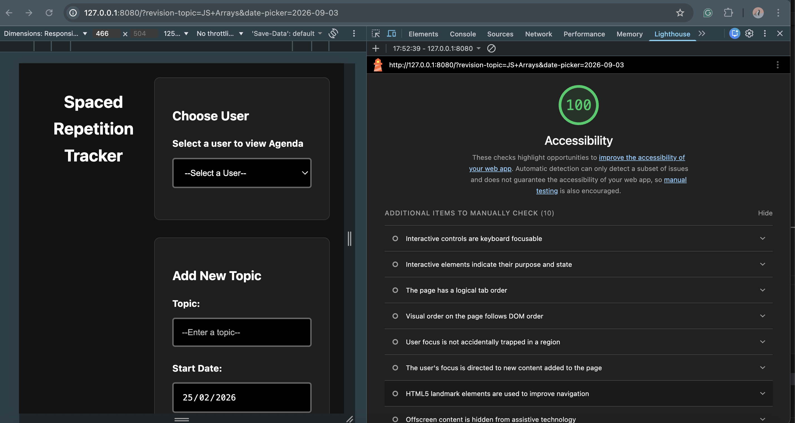

# Piscine-Sprint-3-Project-Spaced-Repetition-Tracker

A web-based application that helps students track learning topics using the **Spaced Repetition** technique, automatically calculating revision dates at intervals of 1 week, 1 month, 3 months, 6 months, and 1 year.

## Live Demo

**View the live site here:** [https://janefrancessc.github.io/Piscine-Sprint-3-Project-Spaced-Repetition-Tracker/](https://janefrancessc.github.io/Piscine-Sprint-3-Project-Spaced-Repetition-Tracker/)

## Features

- **User Management**: Support for 5 distinct user profiles.
- **Automated Scheduling**: Input a topic and start date to generate a full 5-stage revision schedule.
- **Smart Agenda**: Displays upcoming revisions in chronological order.
- **Dynamic Filtering**: Automatically hides revision dates that have already passed.
- **Persistence**: Data is saved to `localStorage`, ensuring information remains available after page refreshes.
- **100% Accessible**: Built with semantic HTML to achieve a perfect Lighthouse accessibility score.

## Tech Stack

- **Frontend**: HTML5, CSS, JavaScript (ES Modules).
- **Storage**: Browser LocalStorage via a provided Storage API.
- **Testing**: Node.js built-in test runner.

## Getting Started

### Prerequisites

- Node.js

### Installation

1. Clone the repository:
   ```bash
   git clone https://github.com/JanefrancessC/Piscine-Sprint-3-Project-Spaced-Repetition-Tracker.git
   ```
2. Navigate to the project folder:
   ```bash
   cd Piscine-Sprint-3-Project-Spaced-Repetition-Tracker
   ```

### Running Locally

Because this project uses ES Modules, it must be served over HTTP. You can use the `http-server` package:

```bash
npx http-server .
```

Open your browser to `http://localhost:8080`.

## Project Structure

- `index.html`: The main user interface.
- `style.css`: Adds basic styling.
- `src/script.mjs`: Handles DOM interactions and coordinates between logic and storage.
- `src/common.mjs`: Pure logic functions for date calculations (The "Brain").
- `data/storage.mjs`: Provided API for LocalStorage interactions.
- `test/common.test.mjs`: Automated unit tests for core logic.

## Accessibility

This project achieves a score of 100 for Accessibility in Lighthouse.


